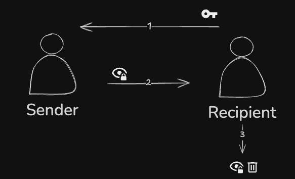
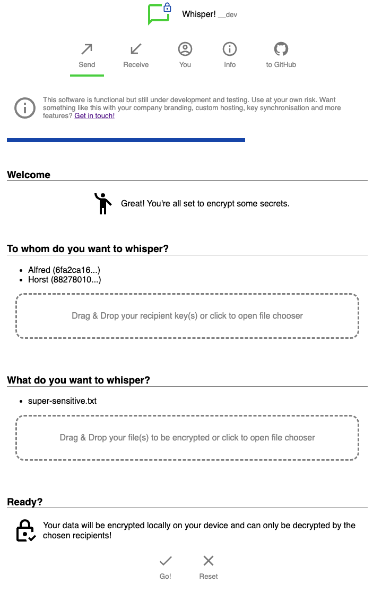
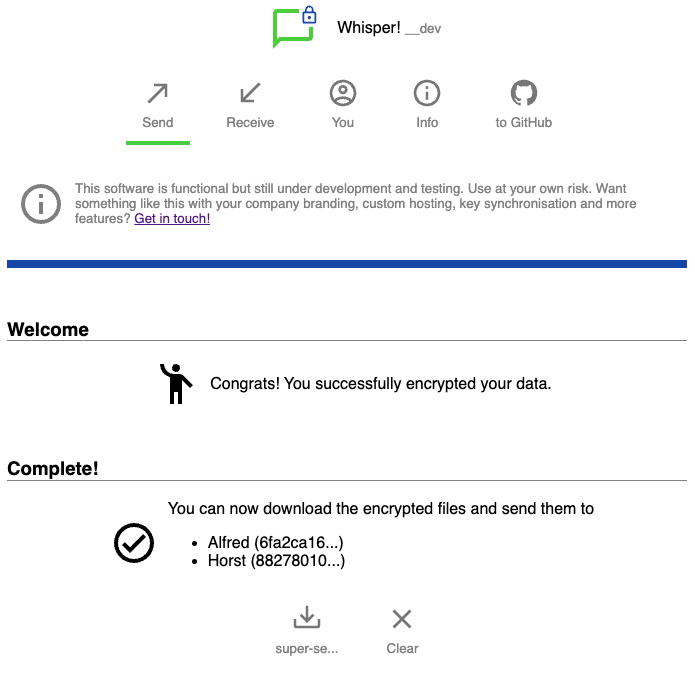
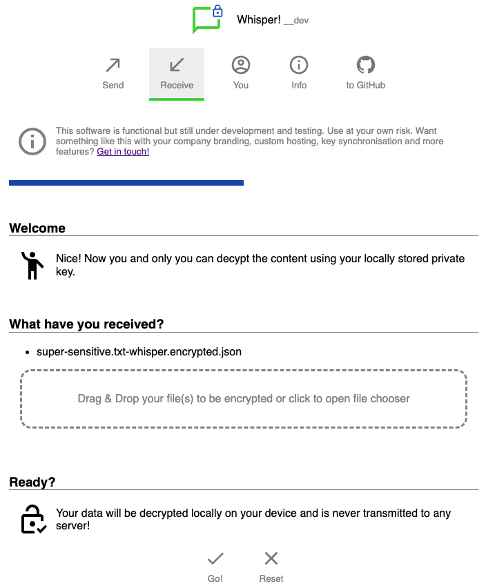
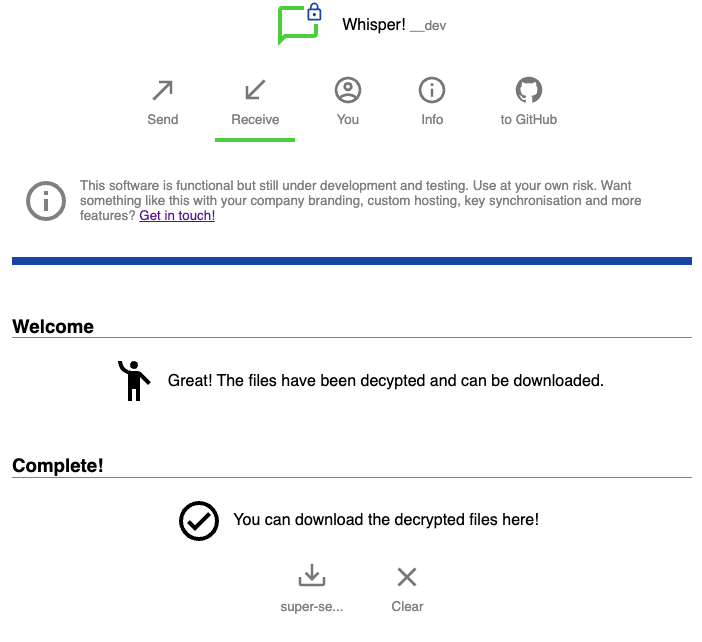

# whisper-ui
 Secure and very easy to use sending of encrypted data anywhere (browser ui)

## Motivation
Make it super easy to locally encrypt sensible data for designated recipients ensuring privacy, integrity and compliance on whatever way the data is transported. Keys should be considered throw away material and not be reused often in order to render the transported cryptograms useless, even if they are retained in e.g. mailboxes.

## How does it work?

This is quite simple: Whisper! uses [asymmetric cryptography](https://en.wikipedia.org/wiki/Public-key_cryptography) and
the [Web Crypto API](https://developer.mozilla.org/en-US/docs/Web/API/Web_Crypto_API) to create two keys. One can be used for encryption and the other for decryption. The latter should not leave your browser's local storage. To exchange sensitive data the following steps are executed:
1. The recipients send their public key parts to the sender and use whatever communication channel they see fit.
1. The sender uses the key parts of all intended recipients, encrypts the data locally in the browser and sends the resulting cryptogram to the recipients.
1. The recipients decrypt the cryptogram locally in their browser and save the sensitive data. They may throw away their keys rendering the cryptogram useless.

Thus the sensitive data never leaves the senders' and recipients' devices.

### Create and encrypt locally in you browser
Drop recipients' keys and some sensitive data, then locally and download cryptograms:
<div style="display: flex;">
    
    &nbsp;
    
</div>

### Receive and decrypt locally in your browser
Drop encrypted stuff you received, then decrypt locally and download result:
<div style="display: flex;">
    
    &nbsp;
    
</div>

## Features (free)
* A keypair is automatically generated locally and stored in the browser's IndexedDB
* The public part of the keypair can be copied and distributed to those who want to send you sensitive data
* The private part remains local and is the only way to decrypt data addressed to you
* Use the hosted version (the good stuff happens locally anyway) or self host and modify it
* TODO: List security and compliance features

## Advanced and convenience features (non-free)
* Get a branded, maintained and supported installation for your organization and its partners
* Access to advanced quantum-resistant cyphers
* Hosted either by Syncorix GmbH as SaaS or on your infrastructure
* Syncronization of public keys within your org and their partner (no need to send them separately)
* Synchronization of the created cryptograms to the designated recepients (no need to send them separately)
* OAuth2 / OIDC login with your IDP or e-mail accounts of your org
* optional audit / usage log
* support with your compliance frameworks and certifications
* TODO: continue

## Stack and development - very early experimental phase ;)
* plain HTML, CSS
* Typescript

some magnificent and lightweight libraries
* [jose](https://github.com/panva/jose) library
* [Pure](https://pure-css.github.io/)
* [Iconify](https://pictogrammers.com/docs/guides/iconify/) and [Material Design Icons](https://pictogrammers.com/library/mdi/)
* [Alpine](https://alpinejs.dev/) for client side magic

Use [Bun](https://bun.sh/) to run build script that compiles icons
```sh
bun run ./build/build-iconify.ts
```

Use [Bun](https://bun.sh/) for on the fly typescript compilation and serving the app
```sh
bun build index.html
```
