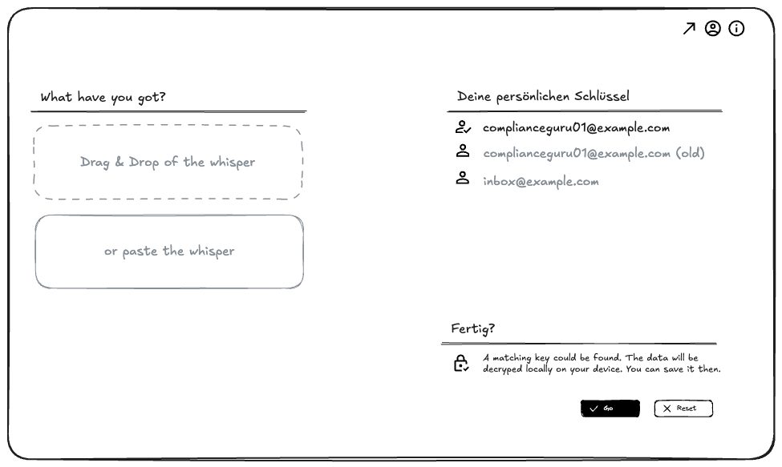

# whisper-ui
 Secure and very easy to use sending of encrypted data anywhere (browser ui)

## idea
Make it super easy to locally encrypt sensible data for only specific recipients ensuring privacy, integrity and compliance on whatever way the data is transported.

### Create and encrypt locally in you browser


### Receive and decrpt locally in your browser


## Features (free)
* A keypair is automatically generated locally and stored in the browser's IndexedDB
* The public part of the keypair can be copied and desitribiuted to those who want to send you sensitive data
* The private part remains local and is the only way to decrypt data addressed to you
* Use the hosted version (the good stuff happens locally anyway) or self host and modify it
* TODO: List security and compliance features

## Advanced and convenience features (non-free)
* Get a branded, maintained and supported installation for your organization and its partners
* Access to advanced quantum-resistant cyphers
* Hosted either by Syncorix GmbH as SaaS or on your infrastructure
* Syncronization of public keys within your org and their partner (no need to send them separately)
* Synchronization of the created cryptograms to the designated recepients (no need to send them separately)
* OAuth2 / OIDC login with your IDP or e-mail accounts of your org
* optional audit / usage log
* TODO: continue


## Stack and development - very early experimental phase ;)
* plain HTML, CSS
* Typescript

some magnificent and lightweigt libraries
* [jose](https://github.com/panva/jose) library
* [Pure](https://pure-css.github.io/)
* [Iconify](https://pictogrammers.com/docs/guides/iconify/) and [Material Design Icons](https://pictogrammers.com/library/mdi/)
* [Alpine](https://alpinejs.dev/) for client side magic

Use [Bun](https://bun.sh/) to run build script that compiles icons
```sh
bun run ./build/build-iconify.ts
```

Use [Bun](https://bun.sh/) for on the fly typescript compilation
```sh
bun build src/* --outdir dist --watch
```

and a http server of your choise to serve, e.g.
```sh
python3 -m http.server 8080
```